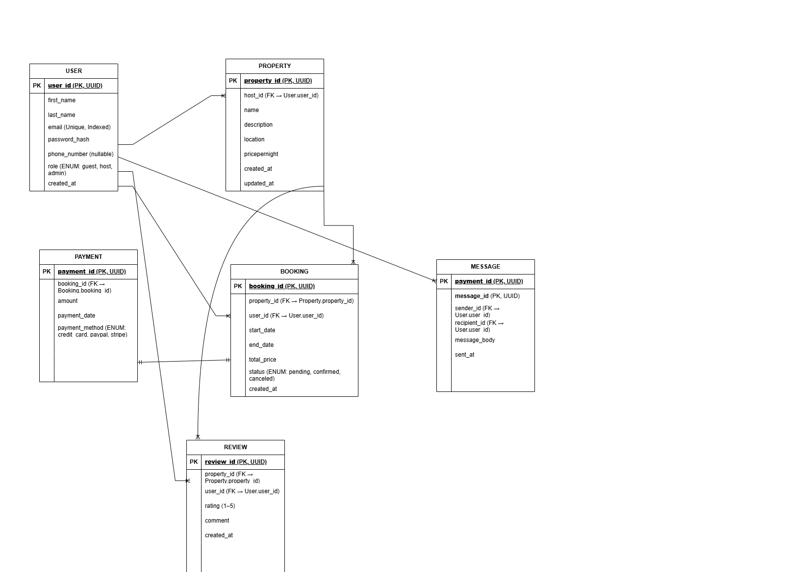

# Airbnb Clone Database - ER Diagram

This document includes the Entity-Relationship Diagram for the backend database design of the Airbnb Clone project.

## Entities:
- User
- Property
- Booking
- Payment
- Image

## Key Relationships:
- Users can list many properties.
- Users can make many bookings.
- Each booking is linked to one user and one property.
- Each booking has one payment.
- Each property can have multiple images.

